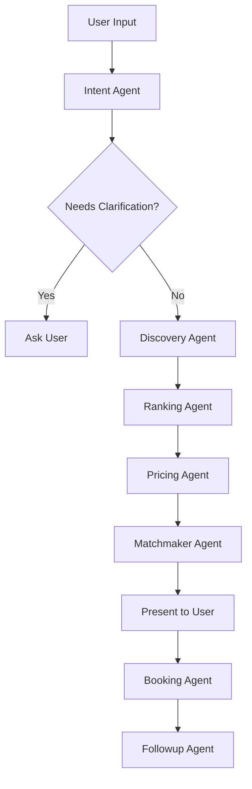

# HireIn — Pakistan Informal Service Economy Orchestrator

One-line: AI-powered 9-agent platform connecting Hyderabad customers with skilled local service providers.

## Problem It Solves
Pakistan's informal service sector (plumbers, electricians, tutors, AC technicians) operates entirely on word-of-mouth and WhatsApp. Finding a reliable provider involves multiple calls, opaque pricing, frequent cancellations, and no quality assurance. 

HireIn solves this by introducing a central AI Orchestrator that parses natural language (including Roman Urdu/Sindhi), matches users with verified providers instantly based on 10 reliability factors, calculates transparent dynamic pricing, handles double-booking conflicts, and automatically resolves post-service disputes.

## Tech Stack
| Layer | Tech |
|---|---|
| **AI Orchestrator** | Google Antigravity |
| **LLM** | Gemini 1.5 Pro |
| **Backend & Cloud** | Firebase Cloud Functions, Firestore |
| **Frontend Mobile App** | Flutter (Dart) |
| **Mapping** | flutter_map, OpenStreetMap |
| **Mock Payments** | Stripe Sandbox |

## Architecture Diagram

```text
[ Flutter Mobile App ]
      |  (REST / HTTPS)
      v
[ Firebase Cloud Functions ]
      |
      v
[ Google Antigravity Orchestrator ]
      |
      |-- 01: Intent Agent
      |-- 02: Discovery Agent
      |-- 03: Ranking Agent
      |-- 04: Pricing Agent
      |-- 05: Matchmaker Agent
      |-- 06: Booking Agent
      |-- 07: Followup Agent
      |-- 08: Review Agent
      |-- 09: Dispute Agent
      |
      v
[ Gemini API ] & [ Firestore Data ]
```

## Google Antigravity Integration
- **Orchestration**: Antigravity orchestrates all 9 agents via the `00_orchestrator.md` file. It sequentially passes data from one agent to the next.
- **Workflow Files**: Every agent's logic is defined strictly in `.agent/workflows/*.md`.
- **Reasoning Traces**: Every workflow run generates a `.md` artifact in the `logs/` directory. These logs are directly exposed to the Flutter app via the "Agent Logs" screen (🧠 icon), allowing full transparency into why AI decisions were made.

## Provider Dataset Schema

| Field | Type | Description |
|---|---|---|
| id | String | Unique ID |
| name | String | Full Pakistani name |
| phone | String | Format: 03XX-XXXXXXX |
| category | String | E.g. AC Technician, Plumber |
| skill_level | String | basic, intermediate, expert |
| specializations | String[] | E.g. ["split AC", "inverter AC"] |
| base_rate_pkr | Number | Base visit fee |
| travel_rate_pkr_per_km | Number | Fee per km traveled |
| lat, lng | Number | Coordinates in Hyderabad |
| rating | Number | 1.0 to 5.0 |
| review_count | Number | Total reviews |
| review_recency_days | Number | Days since last review |
| on_time_score | Number | Percentage (0.0 to 1.0) |
| cancellation_rate | Number | Percentage |
| risk_score | Number | Lower is safer |
| verified | Boolean | Phone verified |
| cnic_verified | Boolean | ID verified |
| languages | String[] | Urdu, Sindhi, Pashto, etc. |
| badges | String[] | Smart badges |
| shift_slots | String[] | Array of ISO datetime strings |
| capacity | Number | Jobs per day |
| jobs_completed | Number | Total platform jobs |
| status | String | approved, pending, suspended |

## Matching Factors
1. Star Rating: 20% (normalized 1-5 → 0-100)
2. Distance/Travel Time: 15% (closer = higher score)
3. Skill Specialization Match: 15% (exact match = 100, partial = 50)
4. On-Time Score: 15% (direct percentage)
5. Shift Availability: 10% (has slot in requested window = 100)
6. Review Recency: 10% (reviewed in last 7 days = 100, 30 days = 60)
7. Budget Match: 5% (if budget_sensitive, cheaper providers score higher)
8. Cancellation Rate: 5% (lower = higher score)
9. Capacity Available: 3% (not at max jobs = higher score)
10. Risk Score: 2% (lower risk = higher score)

## Antigravity Workflow


## APIs and Tools Used
- Gemini API (LLM for intent, reasoning, and matchmaking)
- Firebase Cloud Functions (Backend runtime)
- Firebase Auth (Phone OTP simulation)
- FlutterMap (OpenStreetMap for UI)

## How to Run Locally

1. **Install Firebase CLI**
   `npm install -g firebase-tools`
2. **Start Backend**
   ```bash
   cd functions
   npm install
   export GEMINI_API_KEY="your-key"
   firebase emulators:start
   ```
3. **Start Flutter App**
   ```bash
   cd mobile
   flutter pub get
   flutter run -d chrome  # or an emulator
   ```

## Cost and Latency Analysis
- **Average Time per Agent**: ~600ms to 900ms depending on prompt size.
- **Total Pipeline Time Target**: Under 8 seconds (often 4-6 seconds with Gemini 1.5 Pro).
- **Gemini API Cost Estimate**: ~0.001 USD per end-to-end request (using 1.5 Pro).

## Baseline Comparison
- **Old Way**: WhatsApp messages, phone tag, manual haggling, no show = 0 accountability. Average booking time: 45 minutes to 3 hours.
- **HireIn**: AI parses Roman Urdu, finds the most reliable provider based on 10 metrics, locks transparent pricing, and generates a verified booking in <8 seconds.

## Privacy Note
All location data is used purely for Haversine distance calculations and is never sold. User phone numbers are masked when contacting providers through the app.

## Limitations
1. **Mock Environment**: Currently operates on mock data and simulated Stripe sandbox payments.
2. **Real-time Loc Tracking**: Providers do not have active GPS transponders; tracking is simulated.
3. **Scale**: The 9-agent sequence currently executes synchronously, which could face limits under extreme concurrent load unless optimized via parallel streaming.
